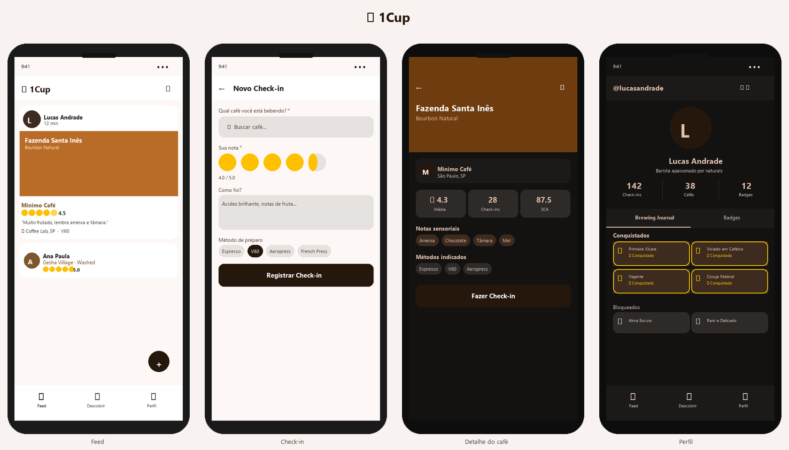
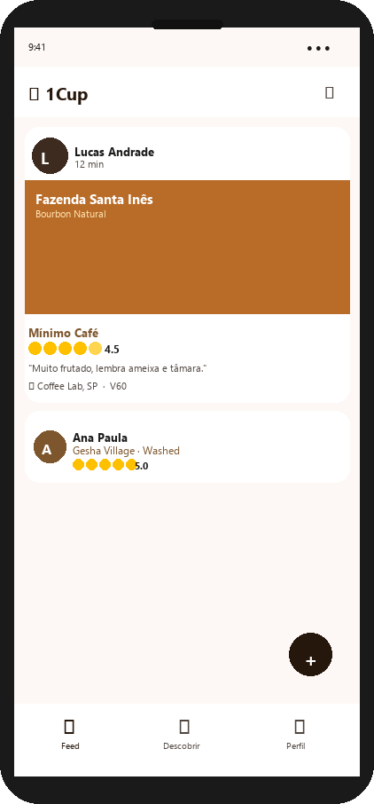
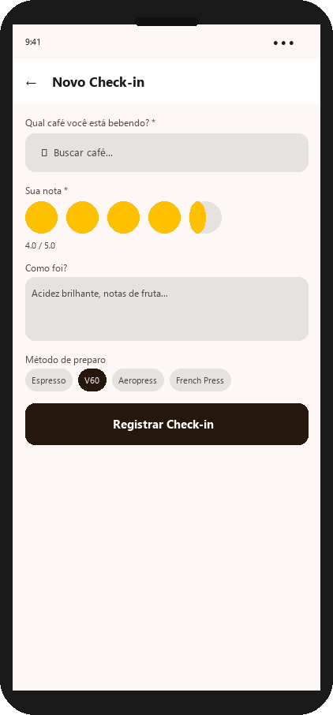
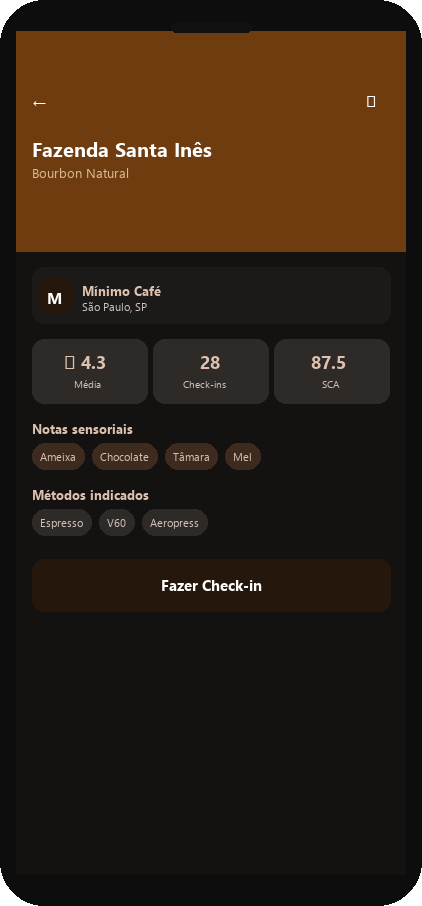
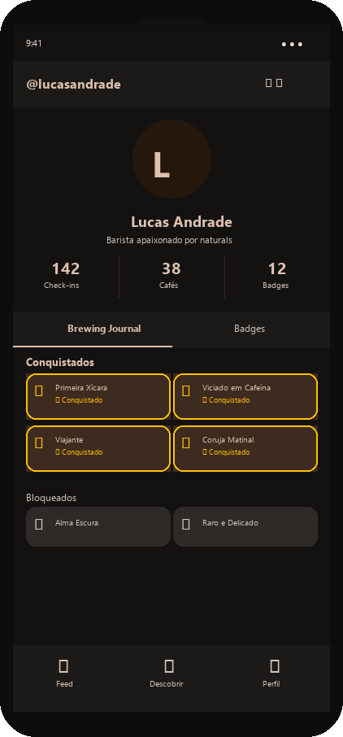

# ☕ 1Cup

> **Gamified specialty coffee social network**  
> Log every cup, collect badges, discover new coffees and share with fellow coffee lovers.

<p align="center">
  
  
  
  
  
  
  
</p>

---

## Screenshots

<p align="center">
  
</p>

| Feed | Check-in | Coffee Detail | Profile & Badges |
|:---:|:---:|:---:|:---:|
| See what friends are drinking in real time — photo, rating, tasting notes | Pick a coffee, rate with half-stars, describe the sensory experience | Full card: community rating, tasting notes, brew methods and SCA score | Cup history, stats and a collection of gold badges |

<p align="center">
  
  
  
  
</p>

---

### Design System — Color Palette

| Token | Light | Dark | Usage |
|---|---|---|---|
| `primary` | `#26170C` ■ | `#DEC1AF` ■ | Buttons, primary actions |
| `secondary` | `#7D562D` ■ | `#F0BD8B` ■ | Secondary elements |
| `surface` | `#FDF8F5` ■ | `#1C1A18` ■ | Cards and surfaces |
| `background` | `#FDF8F5` ■ | `#141210` ■ | Screen background |
| `roastedGold` | `#FFC000` ■ | `#FFD54F` ■ | Stars, premium badges |
| `latteBeige` | `#E9EDC9` ■ | `#2A2E1A` ■ | Tag chips |

**Typography:** `Source Serif 4` for headlines (editorial, premium) + `Hanken Grotesk` for body (readable, modern).

---

## Architecture

```
┌──────────────────────────────────────────────────────────┐
│                        CLIENTS                           │
│   Mobile App (Flutter)          Landing Page (Next.js)   │
└───────────────────────┬──────────────────────────────────┘
                        │ HTTPS / REST API
                        ▼
┌──────────────────────────────────────────────────────────┐
│              API GATEWAY / NGINX                         │
│          Rate limiting  ·  SSL termination               │
└───────────────────────┬──────────────────────────────────┘
                        │
                        ▼
┌──────────────────────────────────────────────────────────┐
│              BACKEND  (Node.js 26 + Fastify 5)           │
│  Auth (JWT)  ·  REST Routes  ·  Badge Engine  ·  Feed   │
└──────────┬───────────────────────┬───────────────────────┘
           │                       │
    ┌──────▼──────┐   ┌────────────▼───────────┐
    │ PostgreSQL  │   │ Redis (cache + sessions)│
    │     17      │   │           8             │
    └─────────────┘   └────────────────────────┘
                              │
                    ┌─────────▼──────┐
                    │  Cloudflare R2 │
                    │   (images)     │
                    └────────────────┘
```

---

## Stack

| Layer | Technology | Reason |
|---|---|---|
| Mobile | Flutter 3.44 | Cross-platform, native performance |
| Backend | Node.js 26 + Fastify 5 | Low overhead, native schema validation |
| Database | PostgreSQL 17 | Robust relational DB, JSON support |
| Cache | Redis 8 | Sessions, rate limiting, feed cache |
| Storage | Cloudflare R2 | Zero egress cost, S3-compatible SDK |
| Auth | JWT (access 15min + refresh 30d) | Stateless + secure rotation |
| Landing | Next.js 15 App Router | SEO, simple Vercel deploy |

> 📄 **In-depth reviews:** [`docs/SECURITY.md`](docs/SECURITY.md) (security audit + fixes) ·
> [`docs/DESIGN_REVIEW.md`](docs/DESIGN_REVIEW.md) (design & UX review).

---

## Monorepo Structure

```
1cup/
├── .github/workflows/      # CI: typecheck, flutter analyze, next build
├── apps/
│   ├── mobile/             # Flutter app
│   │   ├── lib/core/       # Design system, network, router, storage
│   │   ├── lib/features/   # auth, feed, checkin, discover, social, admin
│   │   ├── lib/shared/     # models, widgets
│   │   └── test/           # unit + widget tests
│   ├── backend/            # Fastify API + Prisma
│   │   ├── prisma/         # schema.prisma + migrations
│   │   └── src/
│   │       ├── config/     # env.ts (Zod), database.ts, redis.ts
│   │       ├── modules/    # auth, users, coffees, checkins, feed, friends, badges, admin, waitlist
│   │       └── __tests__/  # vitest unit tests
│   └── landing/            # Next.js 15 landing page
├── docs/screenshots/       # App mockups
├── docker-compose.yml      # PostgreSQL 17 + Redis 8
├── CLAUDE.md               # Development guidelines (TDD/SDD)
└── .env.example
```

---

## Getting Started

### Prerequisites

- [Docker Desktop](https://www.docker.com/products/docker-desktop/)
- [Node.js 26+](https://nodejs.org/)
- [Flutter SDK 3.44+](https://flutter.dev/docs/get-started/install)

### 1. Start database and Redis

```bash
docker-compose up -d
```

### 2. Configure and run the backend

```bash
cd apps/backend
cp .env.example .env
# Fill in your values (JWT secrets, S3 credentials, etc.)
npm install
npm run db:migrate
npm run dev
```

API running at `http://localhost:3000`  
Swagger docs: `http://localhost:3000/docs`

### 3. Run the Flutter app

```bash
cd apps/mobile
flutter pub get
flutter run
```

### 4. Run the landing page

```bash
cd apps/landing
cp .env.local.example .env.local
npm install
npm run dev   # http://localhost:3001
```

### 5. Run tests

```bash
# Backend (unit tests, no DB required)
cd apps/backend && npm test

# Flutter
cd apps/mobile && flutter test
```

---

## Database — Key Entities

```
User ──< CheckIn >── Coffee ──> Roastery
                         └──> Producer
User ──< Friendship >── User
User ──< UserBadge  >── Badge
User ──< EditSuggestion
Waitlist (landing page sign-ups)
```

Versioned migrations with Prisma. After schema changes:

```bash
cd apps/backend
npm run db:migrate   # dev: creates and applies migration
```

---

## Gamification — Badges

**28 badges** across 5 categories and 4 tiers (🥉 Bronze · 🥈 Silver · 🥇 Gold · 💎 Platinum).
The rule engine ([`badges.service.ts`](apps/backend/src/modules/badges/badges.service.ts)) supports
20 rule types; `POST /badges/seed` (admin) populates the catalog and `GET /badges/streak` returns the
check-in streak. Earning a badge fires a `BADGE_EARNED` notification.

### 🏁 Milestone — total check-ins
| Badge | Tier | Requirement |
|---|---|---|
| ☕ Primeira Xícara | 🥉 | 1st check-in |
| ☕ Decafeinado não conta | 🥉 | 10 check-ins |
| ⚡ Viciado em Cafeína | 🥈 | 50 check-ins |
| 🎖️ Centurião do Café | 🥇 | 100 check-ins |
| 🏆 Lenda do Balcão | 💎 | 500 check-ins |

### 🧭 Explorer — variety & origins
| Badge | Tier | Requirement |
|---|---|---|
| 🧭 Explorador | 🥉 | 10 different coffees |
| 🔭 Grande Explorador | 🥇 | 50 different coffees |
| 🏪 Turista de Torrefações | 🥈 | Coffees from 10 different roasteries |
| 🌱 Da Fazenda à Xícara | 🥈 | Coffees from 10 different producers |
| 🌍 Viajante de Xícara | 🥇 | Coffees from 5 different countries |
| 🌿 Caçador de Variedades | 🥈 | 5 different varieties |
| 🧬 Nerd dos Processos | 🥈 | 4 different process methods |

### 👅 Connoisseur — taste & quality
| Badge | Tier | Requirement |
|---|---|---|
| 🌑 Alma Escura | 🥈 | 10 dark-roast check-ins |
| ☀️ Raro e Delicado | 🥈 | 10 light-roast check-ins |
| 🔬 Mestre dos Métodos | 🥈 | 5 different brew methods |
| ⭐ Crítico Exigente | 🥇 | 25 ratings of 4.5★ or higher |
| 💎 Paladar Refinado | 🥇 | 5 coffees with SCA 90+ |
| 📷 Fotógrafo do Café | 🥈 | 20 check-ins with a photo |

### 🔥 Dedication — habits, streaks & timing
| Badge | Tier | Requirement |
|---|---|---|
| 🌅 Coruja Matinal | 🥉 | 5 check-ins before 8 AM |
| 🌙 Coruja Noturna | 🥉 | 5 check-ins after 10 PM |
| 🛋️ Guerreiro de Fim de Semana | 🥉 | 10 weekend check-ins |
| 🔥 Ritual Semanal | 🥈 | 7-day check-in streak |
| 🔥 Hábito de Ferro | 💎 | 30-day check-in streak |

### 👥 Social
| Badge | Tier | Requirement |
|---|---|---|
| 👥 Companhia de Café | 🥉 | 5 friends |
| 👨‍👩‍👧‍👦 Superconector | 🥇 | 25 friends |
| 🔖 Curador | 🥉 | Follow 10 coffees or roasteries |
| 💬 Tagarela | 🥈 | Write 25 comments |
| ❤️ Queridinho | 🥇 | Receive 50 likes |

---

## Roadmap

### Delivered

| Phase | Goal | Status |
|---|---|---|
| **0 — Foundation** | Monorepo, Docker, Fastify, Design System | ✅ Done |
| **1 — Auth** | Login, register, profile, JWT tokens | ✅ Done |
| **2 — Catalog** | CRUD coffees, roasteries, producers | ✅ Done |
| **3 — Check-in & Feed** | Core flow + badge engine + cursor-paginated feed | ✅ Done |
| **4 — Social** | Friendships, filtered feed, public profiles | ✅ Done |
| **5 — Admin** | Edit suggestions, admin panel | ✅ Done |
| **6 — Landing & Polish** | Next.js, dark mode, animations, tests | ✅ Done |
| **6.5 — Security & Design Review** | Hardening + audit + landing polish | ✅ Done |
| **7 — Correctness & Auth hardening** | Schema fix, password reset, email verification, Redis limits, integration tests | ✅ Done |
| **8 — Product depth** | Likes, comments, follows, notifications, catalog filters, blocking, moderation | ✅ Done |
| **9 — Engagement & gamification** | Badge overhaul (28 badges, tiers), streaks, leaderboards, recommendations, onboarding | ✅ Done |

**Phase 7 details:**
- ✅ Fixed `EditSuggestion` schema (separate nullable `coffeeId`/`producerId`/`roasteryId` columns)
- ✅ Password reset (`POST /auth/forgot-password` + `/reset-password`, single-use hashed token)
- ✅ Refresh-token reuse detection (revoke token family on replay)
- ✅ Redis-backed rate-limit store (correct limits across instances, `skipOnError`)
- ✅ Email verification (`/auth/verify-email` + `/auth/resend-verification`, `requireVerified` gate on content writes)
- ✅ Postgres integration tests + dedicated CI job (Fastify `inject` against a real DB)

**Phase 8 details:**
- ✅ Likes & comments on check-ins (block-aware; counts + `likedByMe` embedded in the feed, no N+1)
- ✅ Follow coffees & roasteries; `NEW_COFFEE` fan-out to roastery followers
- ✅ In-app notifications (like, comment, friend request/accept, new coffee) with unread count + read/read-all
- ✅ Catalog search & filters — `roastColor`, `processMethod`, `country`, `scaMin`, `brewMethod`, `sort`
- ✅ User blocking (activates `BLOCKED`) enforced across feed, discover, search, friend requests, likes & comments
- ✅ Report/moderation flow — user submission (rate limited, deduped) + admin review endpoints

**Phase 9 details:**
- ✅ Badge engine overhaul — **28 badges** across 5 categories (Milestone, Explorer, Connoisseur, Social, Dedication) and 4 tiers (Bronze→Platinum), with **20 rule types** (counts, unique origins/roasteries/producers, high-rating, SCA 90+, photos, early-bird/night-owl/weekend, streaks, social)
- ✅ `BADGE_EARNED` notification on unlock (celebration hook); badges re-evaluated on check-ins **and** social actions (likes, comments, follows, friendships)
- ✅ Check-in **streaks** (current + longest, timezone-aware) — `GET /badges/streak`, plus streak badges
- ✅ **Leaderboards** — `GET /engagement/leaderboard?metric=checkins|badges`
- ✅ **Recommendations** — `GET /engagement/recommendations` ("coffees you might like", affinity-based with popularity fallback)
- ✅ **Onboarding** status + suggestions — `GET /engagement/onboarding`
- ✅ Security fix: `POST /badges/seed` is now admin-only (was unauthenticated)

> Push notifications (APNs/FCM) remain a transport follow-up — the in-app `BADGE_EARNED` notification is the celebration signal today. Seasonal challenges are deferred to a later phase.

### Planned — future improvements, by phase

Each phase groups related work so it can be tackled as a focused milestone.

**Phase 10 — Design & UX polish**
- Skeleton loaders, illustrated empty states, page transitions (see `docs/DESIGN_REVIEW.md`)
- Self-hosted fonts (`next/font`), OG/social meta tags, visible theme toggle
- Accessibility pass (contrast, touch targets, screen-reader labels)

**Phase 11 — Stores & scale**
- Production Android/iOS builds + store submission
- Observability (structured logs, metrics, error tracking)
- Image pipeline (thumbnails/resizing), CDN caching, feed caching in Redis
- Load testing and horizontal-scaling validation

---

## What's missing / Known gaps

Tracked so contributors know where the edges are today:

| Area | Gap | Where |
|---|---|---|
| Auth | Production SMTP transport not wired (dev logs the reset/verify link) | `shared/utils/mailer.ts` |
| Feed | Own **private** check-ins don't appear in your own feed | `feed.service.ts` |
| Catalog | Roastery logo upload lacks the creator/admin check the coffee label now has | `roasteries.service.ts` |
| Client | Flutter app not yet wired to the Phase 8 endpoints (likes, comments, follows, notifications, blocks, reports) | `apps/mobile` |
| Client | No client-side role guard on `/admin` routes (API is the real gate) | `app_router.dart` |
| Landing | Google Fonts loaded via external `@import` (privacy + LCP) | `globals.css` |

_Resolved in Phase 7:_ `EditSuggestion` schema, password reset, refresh-token reuse detection,
Redis rate-limit store, email verification, Postgres integration tests in CI._
_Resolved in Phase 8:_ likes, comments, follows, notifications, catalog filters, user blocking, moderation/reports._

---

## Security

A full audit with severities, fixes and recommendations lives in
[`docs/SECURITY.md`](docs/SECURITY.md). Current posture:

**Authentication & authorization**
- **JWT** access token (15 min) + rotated refresh token (30 days, stored as SHA-256 hash)
- **Refresh-token reuse detection** — replaying a revoked token revokes the whole family
- **Email verification** required before creating public content (`requireVerified` gate)
- **Password reset** via single-use hashed token (60-min TTL); resets revoke all sessions
- **Tokens** stored in Keychain (iOS) / Android Keystore via `flutter_secure_storage`
- Admins cannot self-demote; role-guarded routes enforced server-side

**Input & injection**
- **Zod** validates every request body, query and env var; Prisma parameterizes all queries
- **Hardened pagination** — bounded, `NaN`-safe `page`/`perPage` (blocks bulk-exfiltration & DoS)
- **Mass-assignment guard** — edit suggestions restricted to an explicit field allowlist
- Consistent `{ error: { code, message } }` responses; 5xx never leak internal messages/stack

**Abuse & rate limiting**
- **Redis-backed** per-IP rate limiting (100 req/min global; 5/15min on login, register & password
  reset; 30/min on friend requests) — consistent across instances, degrades safely if Redis is down
- `bodyLimit` 256 KB for JSON; multipart capped at 3 files × 5 MB

**Uploads**
- **Magic-byte sniffing** — real JPEG/PNG/WebP signature required (defeats Content-Type spoofing)
- Stored with the detected type + `Content-Disposition: inline`; UUID filenames

**Transport & config**
- **Helmet** + CSP; **HSTS** in production; CORS allowlist; Swagger disabled in production

> ⚠️ **Known open items** (see `docs/SECURITY.md`): production SMTP transport is a dev stub (logs
> the link), the landing still loads Google Fonts via an external `@import`, and user blocking
> (`FriendshipStatus.BLOCKED`) is defined but not implemented.

---

## Testing

This project follows **Test-Driven Development (TDD)**. See [`CLAUDE.md`](CLAUDE.md) for the full guidelines.

```
apps/backend/src/__tests__/   → Vitest unit tests (schema + service logic)
apps/mobile/test/unit/        → Dart unit tests (models, utils)
apps/mobile/test/widget/      → Flutter widget tests
```

CI runs all tests on every push. Integration tests (requiring DB) are run locally with a real Docker environment.

---

## License

MIT © 2025 [luizgdona](https://github.com/luizgdona)
